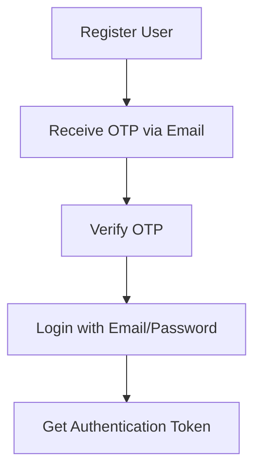
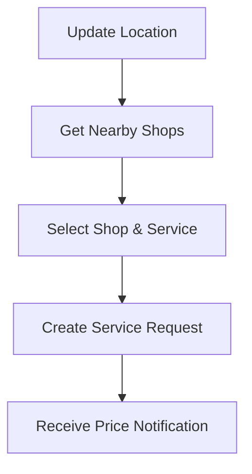
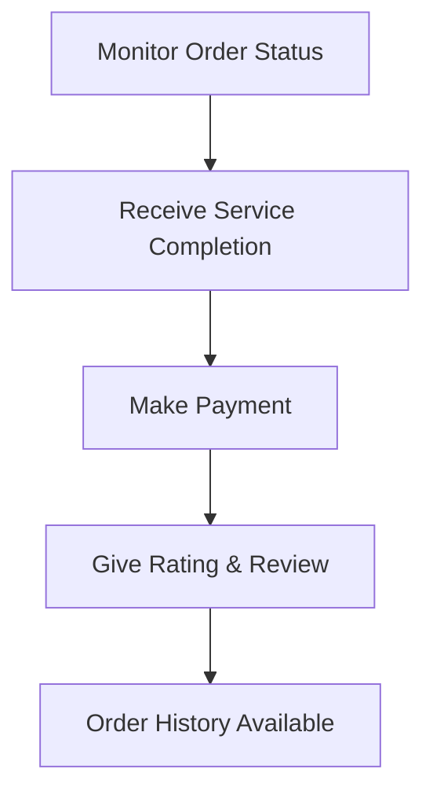
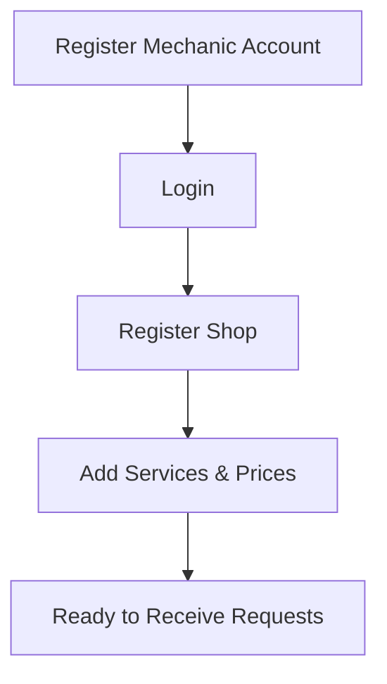
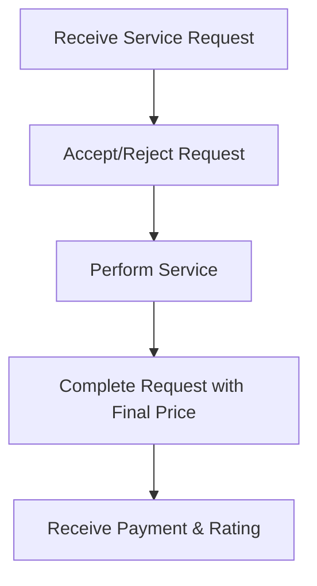
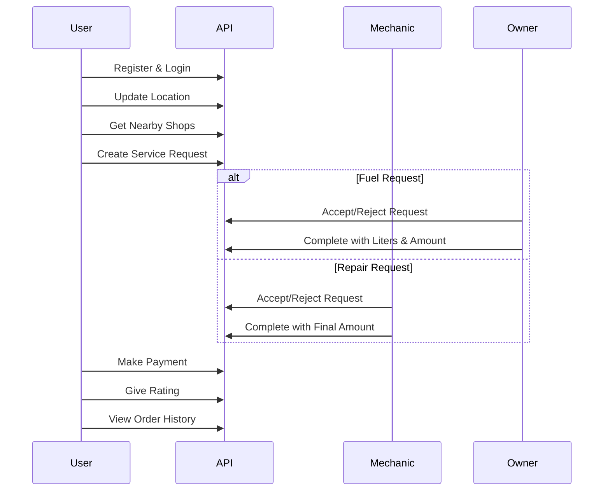
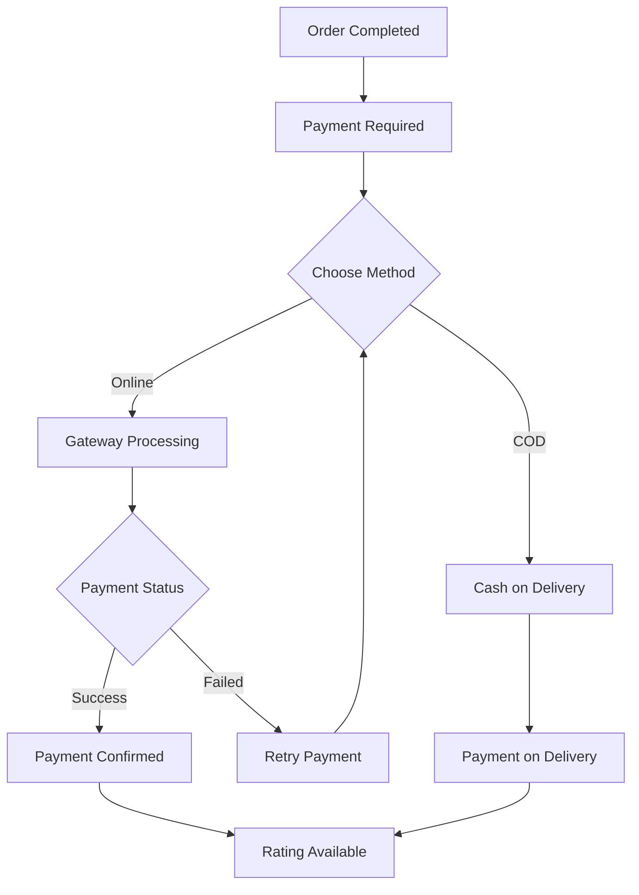

# FuelSand Wheels API Documentation

## Base URL
```
http://localhost/fuelsonwheels/api/v1
```

## Authentication
Most APIs require Bearer token authentication:
```
Authorization: Bearer <token>
```
Tokens are obtained from login/register APIs.

---

## 0. PROFILE APIs

### 0.1 Get Profile
**Endpoint:** `GET /profile/get_profile.php`

**Description:** Get complete user profile information including shop details for mechanics/owners.

**Headers:**
```
Authorization: Bearer <user_token>
```

**Success Response (200):**
```json
{
  "user": {
    "id": 1,
    "email": "user@example.com",
    "role": "user",
    "first_name": "John",
    "last_name": "Doe",
    "phone": "+1234567890",
    "profile_image": "uploads/profile_1234567890.jpg",
    "created_at": "2024-01-01 10:00:00"
  },
  "shop": {
    "id": 1,
    "name": "John's Garage",
    "type": "mechanic",
    "description": "Expert car repair services",
    "address": "123 Main St, City, State",
    "phone": "+1234567890",
    "latitude": 12.9716,
    "longitude": 77.5946,
    "radius": 5,
    "shop_image": "uploads/shop_0987654321.jpg",
    "total_orders": 25,
    "avg_rating": 4.3,
    "created_at": "2024-01-01 10:00:00"
  }
}
```

**Error Responses:**
- **401 Unauthorized:**
```json
{
  "error": "Authorization header missing"
}
```
- **404 Not Found:**
```json
{
  "error": "User not found"
}
```

---

### 0.2 Update Profile
**Endpoint:** `POST /profile/update_profile.php`

**Description:** Update user profile information and shop details.

**Headers:**
```
Content-Type: application/json
Authorization: Bearer <user_token>
```

**Request Body:**
```json
{
  "first_name": "John",
  "last_name": "Smith",
  "phone": "+1234567890",
  "shop": {
    "description": "Expert car repair services",
    "address": "123 Main St, City, State",
    "phone": "+1234567890",
    "latitude": 12.9716,
    "longitude": 77.5946,
    "radius": 5
  }
}
```

**Success Response (200):**
```json
{
  "message": "Profile updated successfully"
}
```

**Error Responses:**
- **401 Unauthorized:**
```json
{
  "error": "Authorization header missing"
}
```
- **500 Internal Server Error:**
```json
{
  "error": "Failed to update profile"
}
```

---

### 0.3 Upload Image
**Endpoint:** `POST /profile/upload_image.php`

**Description:** Upload profile image or shop image.

**Headers:**
```
Authorization: Bearer <user_token>
Content-Type: multipart/form-data
```

**Form Data:**
- `image`: Image file (JPEG, PNG, GIF, max 5MB)
- Query parameter: `image_type=profile` or `image_type=shop`

**Example URL:**
```
POST /profile/upload_image.php?image_type=profile
```

**Success Response (200):**
```json
{
  "message": "Profile image uploaded successfully",
  "image_url": "uploads/profile_1234567890.jpg"
}
```

**Error Responses:**
- **400 Bad Request:**
```json
{
  "error": "Invalid image type. Use 'profile' or 'shop'"
}
```
- **400 Bad Request:**
```json
{
  "error": "No image file provided"
}
```
- **400 Bad Request:**
```json
{
  "error": "Invalid file type. Only JPEG, PNG, and GIF are allowed"
}
```
- **400 Bad Request:**
```json
{
  "error": "File size too large. Maximum 5MB allowed"
}
```
- **403 Forbidden:**
```json
{
  "error": "Only mechanics and owners can upload shop images"
}
```
- **500 Internal Server Error:**
```json
{
  "error": "Failed to save image"
}
```

---

## User Flow Examples

### Complete User Journey

#### 1. User Registration & Login


**API Sequence:**
1. `POST /auth/register.php` - Register account
2. `POST /auth/verify_otp.php` - Verify email
3. `POST /auth/login.php` - Login to get token

#### 2. Service Discovery & Request


**API Sequence:**
1. `POST /user/update_location.php` - Share location
2. `GET /user/get_nearby_shops.php` - Find services
3. `POST /user/create_service_request.php` - Submit request

#### 3. Order Management & Completion


**API Sequence:**
1. `GET /user/get_order_status.php` - Check order status
2. `POST /user/make_payment.php` - Pay for service
3. `POST /user/give_rating.php` - Rate the service
4. `GET /user/get_order_history.php` - View past orders

### Mechanic/Fuel Owner Workflow

#### Mechanic Shop Setup


#### Order Processing Flow


### Complete Application Flow



### Status Flow for Orders
```
PENDING → ACCEPTED → COMPLETED → PAID → RATED
    ↓       ↓         ↓         ↓       ↓
 REJECTED  REJECTED  REJECTED  PENDING  RATED
```

### Payment Flow


---


## 1. AUTHENTICATION APIs

### 1.1 Register User
**Endpoint:** `POST /auth/register.php`

**Description:** Register a new user account and send OTP for verification.

**Headers:**
```
Content-Type: application/json
```

**Request Body:**
```json
{
  "email": "user@example.com",
  "password": "password123",
  "role": "user"
}
```

**Success Response (200):**
```json
{
  "message": "OTP sent to your email for verification"
}
```

**Error Responses:**
- **400 Bad Request:**
```json
{
  "error": "Invalid input data"
}
```
- **409 Conflict:**
```json
{
  "error": "Email already registered"
}
```
- **500 Internal Server Error:**
```json
{
  "error": "Failed to send OTP email"
}
```

---

### 1.2 Verify OTP
**Endpoint:** `POST /auth/verify_otp.php`

**Description:** Verify OTP to complete registration.

**Headers:**
```
Content-Type: application/json
```

**Request Body:**
```json
{
  "email": "user@example.com",
  "otp": "123456"
}
```

**Success Response (200):**
```json
{
  "message": "Registration completed successfully",
  "user_id": 1,
  "token": "1"
}
```

**Error Responses:**
- **400 Bad Request:**
```json
{
  "error": "Invalid input data"
}
```
- **400 Bad Request:**
```json
{
  "error": "Invalid or expired OTP"
}
```
- **400 Bad Request:**
```json
{
  "error": "No pending registration found"
}
```
- **500 Internal Server Error:**
```json
{
  "error": "Failed to create user"
}
```

---

### 1.3 Login
**Endpoint:** `POST /auth/login.php`

**Description:** Authenticate user and get access token.

**Headers:**
```
Content-Type: application/json
```

**Request Body:**
```json
{
  "email": "user@example.com",
  "password": "password123"
}
```

**Success Response (200):**
```json
{
  "message": "Login successful",
  "user": {
    "id": 1,
    "email": "user@example.com",
    "role": "user"
  },
  "token": "1"
}
```

**Error Responses:**
- **400 Bad Request:**
```json
{
  "error": "Invalid input data"
}
```
- **401 Unauthorized:**
```json
{
  "error": "Invalid credentials"
}
```

---

### 1.4 Forgot Password
**Endpoint:** `POST /auth/forgot_password.php`

**Description:** Request password reset OTP.

**Headers:**
```
Content-Type: application/json
```

**Request Body:**
```json
{
  "email": "user@example.com"
}
```

**Success Response (200):**
```json
{
  "message": "OTP sent to your email for password reset"
}
```

**Error Responses:**
- **400 Bad Request:**
```json
{
  "error": "Invalid email"
}
```
- **404 Not Found:**
```json
{
  "error": "Email not found"
}
```
- **500 Internal Server Error:**
```json
{
  "error": "Failed to send OTP email"
}
```

---

### 1.5 Reset Password
**Endpoint:** `POST /auth/reset_password.php`

**Description:** Reset password using OTP.

**Headers:**
```
Content-Type: application/json
```

**Request Body:**
```json
{
  "otp": "123456",
  "new_password": "newpassword123"
}
```

**Success Response (200):**
```json
{
  "message": "Password reset successfully"
}
```

**Error Responses:**
- **400 Bad Request:**
```json
{
  "error": "Invalid input data"
}
```
- **400 Bad Request:**
```json
{
  "error": "No reset request found"
}
```
- **400 Bad Request:**
```json
{
  "error": "Invalid or expired OTP"
}
```
- **500 Internal Server Error:**
```json
{
  "error": "Failed to update password"
}
```

---

## 2. USER APIs

### 2.1 Update Location
**Endpoint:** `POST /user/update_location.php`

**Description:** Update user's current location for proximity searches.

**Headers:**
```
Content-Type: application/json
Authorization: Bearer <user_token>
```

**Request Body:**
```json
{
  "latitude": 12.9716,
  "longitude": 77.5946
}
```

**Success Response (200):**
```json
{
  "message": "Location updated successfully"
}
```

**Error Responses:**
- **400 Bad Request:**
```json
{
  "error": "Invalid coordinates"
}
```
- **401 Unauthorized:**
```json
{
  "error": "Authorization header missing"
}
```
- **500 Internal Server Error:**
```json
{
  "error": "Failed to update location"
}
```

---

### 2.2 Get Nearby Shops
**Endpoint:** `GET /user/get_nearby_shops.php`

**Description:** Find nearby fuel bunks or mechanics based on user location.

**Headers:**
```
Authorization: Bearer <user_token>
```

**Query Parameters:**
- `service_type`: "fuel" or "repair" (required)
- `radius`: Search radius in kilometers (optional, default: 10)

**Example URL:**
```
GET /user/get_nearby_shops.php?service_type=fuel&radius=10
```

**Success Response (200):**
```json
{
  "shops": [
    {
      "id": 1,
      "name": "ABC Fuel Station",
      "latitude": 12.9716,
      "longitude": 77.5946,
      "radius": 10,
      "services": ["Petrol: 100", "Diesel: 90"],
      "distance": 2.5,
      "avg_rating": 4.2
    }
  ]
}
```

**Error Responses:**
- **400 Bad Request:**
```json
{
  "error": "Invalid service type"
}
```
- **400 Bad Request:**
```json
{
  "error": "User location not found"
}
```
- **401 Unauthorized:**
```json
{
  "error": "Authorization header missing"
}
```

---

### 2.3 Create Service Request
**Endpoint:** `POST /user/create_service_request.php`

**Description:** Create a new service request for fuel or repair.

**Headers:**
```
Content-Type: application/json
Authorization: Bearer <user_token>
```

**Request Body:**
```json
{
  "shop_id": 1,
  "service_id": 1,
  "description": "Additional service needed"
}
```

**Success Response (200):**
```json
{
  "message": "Service request created successfully",
  "request_id": 1
}
```

**Error Responses:**
- **400 Bad Request:**
```json
{
  "error": "Shop ID is required"
}
```
- **403 Forbidden:**
```json
{
  "error": "Access denied"
}
```
- **404 Not Found:**
```json
{
  "error": "Shop not found"
}
```
- **400 Bad Request:**
```json
{
  "error": "Invalid service for this shop"
}
```
- **500 Internal Server Error:**
```json
{
  "error": "Failed to create service request"
}
```

---

### 2.4 Get Order History
**Endpoint:** `GET /user/get_order_history.php`

**Description:** Get user's complete order history with pagination.

**Headers:**
```
Authorization: Bearer <user_token>
```

**Query Parameters:**
- `page`: Page number (optional, default: 1)
- `limit`: Items per page (optional, default: 10)

**Example URL:**
```
GET /user/get_order_history.php?page=1&limit=10
```

**Success Response (200):**
```json
{
  "orders": [
    {
      "id": 1,
      "shop_name": "ABC Fuel Station",
      "shop_type": "fuel",
      "service_name": "Petrol",
      "service_price": 100,
      "description": "Additional service needed",
      "status": "completed",
      "final_amount": 2000,
      "liters": 20,
      "requested_at": "2024-01-01 10:00:00",
      "completed_at": "2024-01-01 11:00:00",
      "payment": {
        "amount": 2000,
        "method": "online",
        "status": "paid"
      },
      "rating": {
        "stars": 5,
        "review": "Great service!"
      }
    }
  ],
  "pagination": {
    "page": 1,
    "limit": 10,
    "total": 25,
    "pages": 3
  }
}
```

**Error Responses:**
- **401 Unauthorized:**
```json
{
  "error": "Authorization header missing"
}
```
- **403 Forbidden:**
```json
{
  "error": "Access denied"
}
```

---

### 2.5 Get Order Status
**Endpoint:** `GET /user/get_order_status.php`

**Description:** Get live status and details of a specific order.

**Headers:**
```
Authorization: Bearer <user_token>
```

**Query Parameters:**
- `order_id`: Order ID (required)

**Example URL:**
```
GET /user/get_order_status.php?order_id=1
```

**Success Response (200):**
```json
{
  "order": {
    "id": 1,
    "shop": {
      "id": 1,
      "name": "ABC Fuel Station",
      "type": "fuel",
      "location": {
        "latitude": 12.9716,
        "longitude": 77.5946
      }
    },
    "service": {
      "name": "Petrol",
      "price": 100
    },
    "description": "Additional service needed",
    "status": "completed",
    "final_amount": 2000,
    "liters": 20,
    "requested_at": "2024-01-01 10:00:00",
    "completed_at": "2024-01-01 11:00:00",
    "payment": {
      "amount": 2000,
      "method": "online",
      "status": "paid"
    },
    "rating": {
      "stars": 5,
      "review": "Great service!"
    }
  }
}
```

**Error Responses:**
- **400 Bad Request:**
```json
{
  "error": "Order ID is required"
}
```
- **401 Unauthorized:**
```json
{
  "error": "Authorization header missing"
}
```
- **403 Forbidden:**
```json
{
  "error": "Access denied"
}
```
- **404 Not Found:**
```json
{
  "error": "Order not found"
}
```

---

### 2.6 Make Payment
**Endpoint:** `POST /user/make_payment.php`

**Description:** Process payment for completed orders.

**Headers:**
```
Content-Type: application/json
Authorization: Bearer <user_token>
```

**Request Body:**
```json
{
  "order_id": 1,
  "payment_method": "online"
}
```

**Success Response (200):**
```json
{
  "message": "Payment processed successfully",
  "payment_id": 1,
  "status": "paid",
  "method": "online",
  "amount": 2000
}
```

**Error Responses:**
- **400 Bad Request:**
```json
{
  "error": "Invalid input data"
}
```
- **401 Unauthorized:**
```json
{
  "error": "Authorization header missing"
}
```
- **403 Forbidden:**
```json
{
  "error": "Access denied"
}
```
- **404 Not Found:**
```json
{
  "error": "Order not found or not completed"
}
```
- **409 Conflict:**
```json
{
  "error": "Payment already processed"
}
```
- **500 Internal Server Error:**
```json
{
  "error": "Failed to process payment"
}
```

---

### 2.7 Give Rating
**Endpoint:** `POST /user/give_rating.php`

**Description:** Rate and review a completed service after payment.

**Headers:**
```
Content-Type: application/json
Authorization: Bearer <user_token>
```

**Request Body:**
```json
{
  "order_id": 1,
  "rating": 5,
  "review": "Great service!"
}
```

**Success Response (200):**
```json
{
  "message": "Rating submitted successfully",
  "rating": 5,
  "review": "Great service!"
}
```

**Error Responses:**
- **400 Bad Request:**
```json
{
  "error": "Invalid input data"
}
```
- **400 Bad Request:**
```json
{
  "error": "Payment must be completed before rating"
}
```
- **401 Unauthorized:**
```json
{
  "error": "Authorization header missing"
}
```
- **403 Forbidden:**
```json
{
  "error": "Access denied"
}
```
- **404 Not Found:**
```json
{
  "error": "Order not found or not completed"
}
```
- **500 Internal Server Error:**
```json
{
  "error": "Failed to save rating"
}
```

---

## 3. MECHANIC APIs

### 3.1 Register Shop
**Endpoint:** `POST /mechanic/register_shop.php`

**Description:** Register a mechanic shop with location and service radius.

**Headers:**
```
Content-Type: application/json
Authorization: Bearer <mechanic_token>
```

**Request Body:**
```json
{
  "name": "John's Garage",
  "latitude": 12.9716,
  "longitude": 77.5946,
  "radius": 5
}
```

**Success Response (200):**
```json
{
  "message": "Shop registered successfully",
  "shop_id": 1
}
```

**Error Responses:**
- **400 Bad Request:**
```json
{
  "error": "Invalid input data"
}
```
- **403 Forbidden:**
```json
{
  "error": "Access denied"
}
```
- **409 Conflict:**
```json
{
  "error": "Shop already registered"
}
```
- **500 Internal Server Error:**
```json
{
  "error": "Failed to register shop"
}
```

---

### 3.2 Add Service
**Endpoint:** `POST /mechanic/add_service.php`

**Description:** Add a repair service with price.

**Headers:**
```
Content-Type: application/json
Authorization: Bearer <mechanic_token>
```

**Request Body:**
```json
{
  "name": "Oil Change",
  "price": 500
}
```

**Success Response (200):**
```json
{
  "message": "Service added successfully",
  "service_id": 1
}
```

**Error Responses:**
- **400 Bad Request:**
```json
{
  "error": "Invalid input data"
}
```
- **403 Forbidden:**
```json
{
  "error": "Access denied"
}
```
- **404 Not Found:**
```json
{
  "error": "Shop not found"
}
```
- **500 Internal Server Error:**
```json
{
  "error": "Failed to add service"
}
```

---

### 3.3 Accept/Reject Request
**Endpoint:** `POST /mechanic/accept_reject_request.php`

**Description:** Accept or reject a service request.

**Headers:**
```
Content-Type: application/json
Authorization: Bearer <mechanic_token>
```

**Request Body:**
```json
{
  "request_id": 1,
  "action": "accept"
}
```

**Success Response (200):**
```json
{
  "message": "Request accepted successfully"
}
```

**Error Responses:**
- **400 Bad Request:**
```json
{
  "error": "Invalid input data"
}
```
- **403 Forbidden:**
```json
{
  "error": "Access denied"
}
```
- **404 Not Found:**
```json
{
  "error": "Request not found or not pending"
}
```
- **500 Internal Server Error:**
```json
{
  "error": "Failed to update request status"
}
```

---

### 3.4 Complete Request
**Endpoint:** `POST /mechanic/complete_request.php`

**Description:** Mark service request as completed and set final amount.

**Headers:**
```
Content-Type: application/json
Authorization: Bearer <mechanic_token>
```

**Request Body:**
```json
{
  "request_id": 1,
  "final_amount": 550
}
```

**Success Response (200):**
```json
{
  "message": "Request completed successfully"
}
```

**Error Responses:**
- **400 Bad Request:**
```json
{
  "error": "Invalid input data"
}
```
- **403 Forbidden:**
```json
{
  "error": "Access denied"
}
```
- **404 Not Found:**
```json
{
  "error": "Request not found or not accepted"
}
```
- **500 Internal Server Error:**
```json
{
  "error": "Failed to complete request"
}
```

---

### 3.5 View Service Requests
**Endpoint:** `GET /mechanic/view-requests`

**Description:** Get list of service requests received by the mechanic with filtering and pagination.

**Headers:**
```
Authorization: Bearer <mechanic_token>
```

**Query Parameters:**
- `status`: Filter by status (pending, accepted, rejected, completed) - optional
- `page`: Page number (default: 1) - optional
- `limit`: Items per page (default: 20) - optional

**Example URL:**
```
GET /mechanic/view-requests?status=pending&page=1&limit=10
```

**Success Response (200):**
```json
{
  "success": true,
  "data": {
    "requests": [
      {
        "id": 1,
        "user": {
          "id": 2,
          "name": "Alice Johnson",
          "phone": "9876543210"
        },
        "service_name": "Brake Repair",
        "description": "Front brake pads need replacement",
        "estimated_price": 1200.00,
        "final_price": null,
        "status": "pending",
        "user_location": {
          "latitude": 12.9716,
          "longitude": 77.5946,
          "address": "123 Main St, Bangalore"
        },
        "created_at": "2024-01-15 10:30:00",
        "updated_at": "2024-01-15 10:30:00"
      }
    ],
    "pagination": {
      "page": 1,
      "limit": 10,
      "total": 5,
      "total_pages": 1
    }
  }
}
```

**Error Responses:**
- **403 Forbidden:**
```json
{
  "error": "Access denied"
}
```
- **404 Not Found:**
```json
{
  "error": "Shop not found"
}
```

---

### 3.6 Track User Location
**Endpoint:** `GET /mechanic/track-user-location`

**Description:** Get real-time location of user for a specific service request.

**Headers:**
```
Authorization: Bearer <mechanic_token>
```

**Query Parameters:**
- `request_id`: Service request ID (required)

**Example URL:**
```
GET /mechanic/track-user-location?request_id=1
```

**Success Response (200):**
```json
{
  "success": true,
  "request_id": 1,
  "user": {
    "id": 2,
    "name": "Alice Johnson",
    "phone": "9876543210"
  },
  "service": {
    "type": "Brake Repair",
    "status": "in_progress"
  },
  "current_location": {
    "latitude": 12.9716,
    "longitude": 77.5946,
    "last_updated": "2024-01-15 14:30:00"
  },
  "distance_from_shop": 5.2,
  "unit": "km"
}
```

**Error Responses:**
- **400 Bad Request:**
```json
{
  "error": "Request ID is required"
}
```
- **403 Forbidden:**
```json
{
  "error": "Access denied"
}
```
- **404 Not Found:**
```json
{
  "error": "Request not found or not in progress"
}
```
- **404 Not Found:**
```json
{
  "error": "User location not available"
}
```

---

### 3.7 Update Live Location
**Endpoint:** `POST /mechanic/update-location`

**Description:** Update mechanic's current location during service delivery.

**Headers:**
```
Content-Type: application/json
Authorization: Bearer <mechanic_token>
```

**Request Body:**
```json
{
  "latitude": 12.9716,
  "longitude": 77.5946,
  "request_id": 1  // Optional: link to specific service request
}
```

**Success Response (200):**
```json
{
  "success": true,
  "message": "Location updated successfully",
  "location": {
    "latitude": 12.9716,
    "longitude": 77.5946,
    "timestamp": "2024-01-15 14:30:00"
  }
}
```

**Error Responses:**
- **400 Bad Request:**
```json
{
  "error": "Invalid coordinates"
}
```
- **403 Forbidden:**
```json
{
  "error": "Access denied"
}
```
- **404 Not Found:**
```json
{
  "error": "Mechanic shop not found"
}
```
- **500 Internal Server Error:**
```json
{
  "error": "Failed to update location"
}
```

---

### 3.8 Get Dashboard
**Endpoint:** `GET /mechanic/dashboard.php`

**Description:** Get mechanic's business statistics.

**Headers:**
```
Authorization: Bearer <mechanic_token>
```

**Success Response (200):**
```json
{
  "dashboard": {
    "pending_orders": 5,
    "total_delivered": 20,
    "total_earnings": 15000,
    "total_orders": 25,
    "rating": 4.3
  }
}
```

**Error Responses:**
- **403 Forbidden:**
```json
{
  "error": "Access denied"
}
```
- **404 Not Found:**
```json
{
  "error": "Shop not found"
}
```

---

## 4. FUEL BUNK OWNER APIs

### 4.1 Register Bunk
**Endpoint:** `POST /owner/register_bunk.php`

**Description:** Register a fuel bunk with location and service radius.

**Headers:**
```
Content-Type: application/json
Authorization: Bearer <owner_token>
```

**Request Body:**
```json
{
  "name": "XYZ Fuel Bunk",
  "latitude": 12.9716,
  "longitude": 77.5946,
  "radius": 5
}
```

**Success Response (200):**
```json
{
  "message": "Fuel bunk registered successfully",
  "bunk_id": 1
}
```

**Error Responses:**
- **400 Bad Request:**
```json
{
  "error": "Invalid input data"
}
```
- **403 Forbidden:**
```json
{
  "error": "Access denied"
}
```
- **409 Conflict:**
```json
{
  "error": "Bunk already registered"
}
```
- **500 Internal Server Error:**
```json
{
  "error": "Failed to register bunk"
}
```

---

### 4.2 Add Fuel Price
**Endpoint:** `POST /owner/add_fuel_price.php`

**Description:** Add fuel type with price per liter.

**Headers:**
```
Content-Type: application/json
Authorization: Bearer <owner_token>
```

**Request Body:**
```json
{
  "name": "Petrol",
  "price": 100
}
```

**Success Response (200):**
```json
{
  "message": "Fuel price added successfully",
  "service_id": 1
}
```

**Error Responses:**
- **400 Bad Request:**
```json
{
  "error": "Invalid input data"
}
```
- **403 Forbidden:**
```json
{
  "error": "Access denied"
}
```
- **404 Not Found:**
```json
{
  "error": "Bunk not found"
}
```
- **500 Internal Server Error:**
```json
{
  "error": "Failed to add fuel price"
}
```

---

### 4.3 Complete Fuel Request
**Endpoint:** `POST /owner/complete_fuel_request.php`

**Description:** Mark fuel request as completed with final amount and liters delivered.

**Headers:**
```
Content-Type: application/json
Authorization: Bearer <owner_token>
```

**Request Body:**
```json
{
  "request_id": 1,
  "final_amount": 2000,
  "liters": 20
}
```

**Success Response (200):**
```json
{
  "message": "Fuel request completed successfully"
}
```

**Error Responses:**
- **400 Bad Request:**
```json
{
  "error": "Invalid input data"
}
```
- **403 Forbidden:**
```json
{
  "error": "Access denied"
}
```
- **404 Not Found:**
```json
{
  "error": "Request not found or not accepted"
}
```
- **500 Internal Server Error:**
```json
{
  "error": "Failed to complete request"
}
```

---

### 4.4 Accept/Reject Fuel Request
**Endpoint:** `POST /owner/accept-reject-request`

**Description:** Accept or reject a fuel delivery request.

**Headers:**
```
Content-Type: application/json
Authorization: Bearer <owner_token>
```

**Request Body:**
```json
{
  "request_id": 1,
  "action": "accept"
}
```

**Success Response (200):**
```json
{
  "message": "Fuel request accepted successfully"
}
```

**Error Responses:**
- **400 Bad Request:**
```json
{
  "error": "Invalid input data"
}
```
- **403 Forbidden:**
```json
{
  "error": "Access denied"
}
```
- **404 Not Found:**
```json
{
  "error": "Request not found or not pending"
}
```
- **500 Internal Server Error:**
```json
{
  "error": "Failed to update request status"
}
```

---

### 4.5 View Fuel Requests
**Endpoint:** `GET /owner/view-requests`

**Description:** Get list of fuel requests received by the owner with filtering and pagination.

**Headers:**
```
Authorization: Bearer <owner_token>
```

**Query Parameters:**
- `status`: Filter by status (pending, accepted, rejected, completed) - optional
- `page`: Page number (default: 1) - optional
- `limit`: Items per page (default: 20) - optional

**Example URL:**
```
GET /owner/view-requests?status=pending&page=1&limit=10
```

**Success Response (200):**
```json
{
  "success": true,
  "data": {
    "requests": [
      {
        "id": 2,
        "user": {
          "id": 3,
          "name": "Bob Smith",
          "phone": "9876543211"
        },
        "fuel_type": "Petrol",
        "quantity": 20,
        "estimated_price": 2210.00,
        "final_price": null,
        "status": "pending",
        "user_location": {
          "latitude": 12.9716,
          "longitude": 77.5946,
          "address": "456 Oak St, Bangalore"
        },
        "created_at": "2024-01-15 11:00:00",
        "updated_at": "2024-01-15 11:00:00"
      }
    ],
    "pagination": {
      "page": 1,
      "limit": 10,
      "total": 8,
      "total_pages": 1
    }
  }
}
```

**Error Responses:**
- **403 Forbidden:**
```json
{
  "error": "Access denied"
}
```
- **404 Not Found:**
```json
{
  "error": "Fuel bunk not found"
}
```

---

### 4.6 Track User Location
**Endpoint:** `GET /owner/track-user-location`

**Description:** Get real-time location of user for fuel delivery.

**Headers:**
```
Authorization: Bearer <owner_token>
```

**Query Parameters:**
- `request_id`: Fuel request ID (required)

**Example URL:**
```
GET /owner/track-user-location?request_id=2
```

**Success Response (200):**
```json
{
  "success": true,
  "request_id": 2,
  "user": {
    "id": 3,
    "name": "Bob Smith",
    "phone": "9876543211"
  },
  "fuel_request": {
    "fuel_type": "Petrol",
    "quantity": 20,
    "status": "in_progress"
  },
  "current_location": {
    "latitude": 12.9716,
    "longitude": 77.5946,
    "last_updated": "2024-01-15 14:35:00"
  },
  "distance_from_bunk": 3.8,
  "estimated_delivery_time": 12,
  "unit": "km",
  "time_unit": "minutes"
}
```

**Error Responses:**
- **400 Bad Request:**
```json
{
  "error": "Request ID is required"
}
```
- **403 Forbidden:**
```json
{
  "error": "Access denied"
}
```
- **404 Not Found:**
```json
{
  "error": "Fuel request not found or not in progress"
}
```
- **404 Not Found:**
```json
{
  "error": "User location not available"
}
```

---

### 4.7 Update Live Location
**Endpoint:** `POST /owner/update-location`

**Description:** Update owner's current location during fuel delivery.

**Headers:**
```
Content-Type: application/json
Authorization: Bearer <owner_token>
```

**Request Body:**
```json
{
  "latitude": 12.9716,
  "longitude": 77.5946,
  "request_id": 2  // Optional: link to specific fuel request
}
```

**Success Response (200):**
```json
{
  "success": true,
  "message": "Location updated successfully",
  "location": {
    "latitude": 12.9716,
    "longitude": 77.5946,
    "timestamp": "2024-01-15 14:30:00"
  }
}
```

**Error Responses:**
- **400 Bad Request:**
```json
{
  "error": "Invalid coordinates"
}
```
- **403 Forbidden:**
```json
{
  "error": "Access denied"
}
```
- **404 Not Found:**
```json
{
  "error": "Fuel bunk not found"
}
```
- **500 Internal Server Error:**
```json
{
  "error": "Failed to update location"
}
```

---

### 4.8 Get Dashboard
**Endpoint:** `GET /owner/dashboard.php`

**Description:** Get fuel bunk owner's business statistics.

**Headers:**
```
Authorization: Bearer <owner_token>
```

**Success Response (200):**
```json
{
  "dashboard": {
    "pending_orders": 3,
    "total_delivered": 15,
    "total_earnings": 25000,
    "total_orders": 18,
    "rating": 4.5,
    "total_liters_delivered": 300
  }
}
```

**Error Responses:**
- **403 Forbidden:**
```json
{
  "error": "Access denied"
}
```
- **404 Not Found:**
```json
{
  "error": "Bunk not found"
}
```

---

## 5. USER LOCATION TRACKING APIs

### 5.1 Track Mechanic Location
**Endpoint:** `GET /user/track-mechanic-location`

**Description:** Track mechanic's location during service delivery.

**Headers:**
```
Authorization: Bearer <user_token>
```

**Query Parameters:**
- `request_id`: Service request ID (required)

**Example URL:**
```
GET /user/track-mechanic-location?request_id=1
```

**Success Response (200):**
```json
{
  "success": true,
  "request_id": 1,
  "mechanic": {
    "name": "John Smith",
    "phone": "9876543210",
    "shop_name": "John's Auto Repair"
  },
  "service": {
    "status": "in_progress",
    "description": "Brake repair service"
  },
  "mechanic_location": {
    "latitude": 12.9716,
    "longitude": 77.5946,
    "last_updated": "2024-01-15 14:30:00"
  },
  "distance_to_user": 2.1,
  "estimated_arrival_time": 6,
  "unit": "km",
  "time_unit": "minutes"
}
```

**Error Responses:**
- **400 Bad Request:**
```json
{
  "error": "Request ID is required"
}
```
- **403 Forbidden:**
```json
{
  "error": "Access denied"
}
```
- **404 Not Found:**
```json
{
  "error": "Service request not found or not in progress"
}
```
- **404 Not Found:**
```json
{
  "error": "Mechanic location not available"
}
```

---

### 5.2 Track Fuel Delivery Location
**Endpoint:** `GET /user/track-owner-location`

**Description:** Track fuel delivery personnel location during delivery.

**Headers:**
```
Authorization: Bearer <user_token>
```

**Query Parameters:**
- `request_id`: Fuel request ID (required)

**Example URL:**
```
GET /user/track-owner-location?request_id=2
```

**Success Response (200):**
```json
{
  "success": true,
  "request_id": 2,
  "delivery_personnel": {
    "name": "Rajesh Kumar",
    "phone": "9876543212",
    "fuel_bunk_name": "City Fuel Station"
  },
  "fuel_delivery": {
    "fuel_type": "Petrol",
    "quantity": 20,
    "status": "in_progress"
  },
  "delivery_location": {
    "latitude": 12.9716,
    "longitude": 77.5946,
    "last_updated": "2024-01-15 14:30:00"
  },
  "distance_to_user": 1.8,
  "estimated_delivery_time": 4,
  "unit": "km",
  "time_unit": "minutes"
}
```

**Error Responses:**
- **400 Bad Request:**
```json
{
  "error": "Request ID is required"
}
```
- **403 Forbidden:**
```json
{
  "error": "Access denied"
}
```
- **404 Not Found:**
```json
{
  "error": "Fuel request not found or not in progress"
}
```
- **404 Not Found:**
```json
{
  "error": "Delivery personnel location not available"
}
```

---

## 6. ADDITIONAL FEATURES

### Live Location Tracking
- **Real-time Updates**: All location tracking APIs provide current location data
- **Distance Calculation**: Haversine formula used for accurate distance computation
- **ETA Estimation**: Intelligent time calculations based on distance and speed
- **Security**: Role-based access control for all location APIs
- **Performance**: Optimized database queries with proper indexing

### Request Management
- **Filtering**: Filter requests by status (pending, accepted, rejected, completed)
- **Pagination**: Efficient handling of large request lists
- **Real-time Status**: Live updates on request status changes
- **User Context**: Rich user information in request responses

### Database Schema Updates
- **mechanic_locations**: Table for storing mechanic and owner live locations
- **Enhanced Indexing**: Optimized queries for location-based operations
- **Foreign Key Constraints**: Data integrity across all tables

## HTTP Status Codes

- **200 OK**: Request successful
- **400 Bad Request**: Invalid input data or parameters
- **401 Unauthorized**: Missing or invalid authentication token
- **403 Forbidden**: Insufficient permissions for the operation
- **404 Not Found**: Resource not found
- **409 Conflict**: Resource already exists
- **500 Internal Server Error**: Server-side error

## Data Types

- **String**: Text data
- **Integer**: Whole numbers
- **Decimal**: Floating point numbers (lat/lng, prices)
- **Boolean**: true/false values
- **Array**: List of items
- **Object**: Key-value pairs

## Rate Limiting

No rate limiting implemented in current version. Consider adding for production use.

## CORS

All endpoints support CORS for mobile app integration.
